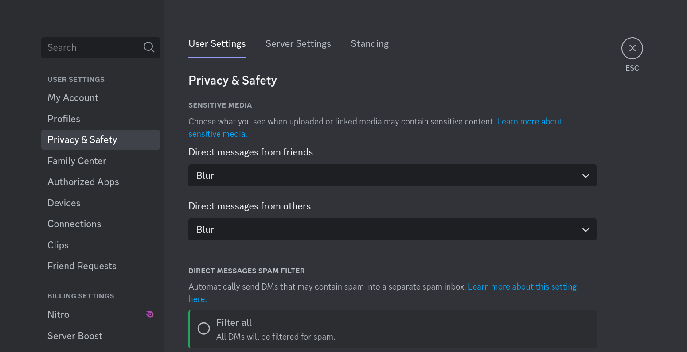
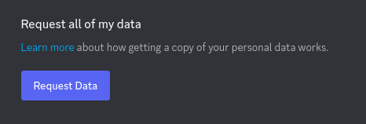

# DCMD

Discord Messages Dumper

## What is this?
It's a simple script to dump all your messages from Discord into a plain JSON.

## Data Preparation
1. Go to Privacy & Safety on your Discord's user settings.

    

2. Scroll all the way down and find the blue "**Request Data**" button and click it.
  
    

3. Wait for a few days until you receive `package.zip` from Discord in your email (it takes a very long time, depending on how many messages you've sent, selecting more fields will take it even longer)

## Usage

1. Download this repository and extract it or run `git clone https://github.com/RuriYS/DCMD.git`
2. Download `package.zip` if you haven't already from the email Discord sent 
3. Copy `messages` folder into `DCMD`
4. Configure your filters in `config.json`:
```json
{
    "messages_path": "messages",
    "filters": {
        "links": false,      // Remove messages with URLs
        "emojis": false,     // Remove messages with emojis
        "commands": true,    // Remove messages starting with command prefixes
        "words": false,      // Remove messages containing filtered words
        "multilines": false, // Remove messages with multiple lines
        "duplicates": true,  // Remove duplicate messages
        "numbers": false     // Remove messages containing only numbers
    },
    "length": {
        "min": 1,           // Minimum token count
        "max": null         // Maximum token count (null for unlimited)
    },
    "limit": null,          // Maximum messages to dump (null for unlimited)
    "output": ["json", "txt"],                              // Generate both formats
    "command_prefixes": ["$", "%", "!", ".", "#", "<a:"],   // Command prefixes to filter
    "filtered_words": ["\n", "**", "<@", "<#", "`", "://"], // Words to filter
    "channels": {
        "whitelist": [],    // Only include these channel IDs (if empty, use blacklist)
        "blacklist": []     // Ignore these channel IDs
    },
    "guilds": {
        "whitelist": [],    // Only include these guild names (if empty, use blacklist)
        "blacklist": ["A certain guild"]  // Ignore these guild names
    },
    "ignore_dms": false     // Set to true to ignore all DMs
}
```
5. Run the script:
```bash
python main.py
```
6. Filtered messages will be saved to `dump.json`:
```json
[
    {
        "channel_id": "990518804062810133",
        "channel_name": "general",
        "guild_name": "DM or Guild Name",
        "messages": [
            "message", ...
        ]
    }, ...
]
```

## Output Format
The script supports two output formats, configurable via the `output` option in `config.json`:
- `json`: Messages organized by channel ID in a JSON file (dump.json)
- `txt`: Messages in a flat text file, one per line (dump.txt)


## Message Filtering

### Channel and Guild Filtering
- **Channel Filtering**: 
  - Use whitelist to only include specific channels
  - Use blacklist to exclude specific channels
  - If whitelist is not empty, only whitelisted channels are included
  - If whitelist is empty but blacklist is populated, all channels except blacklisted ones are included
  - If both are empty, all channels are included
- **Guild Filtering**: 
  - Same whitelist/blacklist logic as channels but applies to guild names
- **DM Filtering**: Set `ignore_dms` to `true` to skip all direct messages

### Content Filtering
- **Links**: Remove messages containing URLs
- **Emojis**: Remove messages containing emoji
- **Commands**: Remove messages starting with command prefixes
- **Words**: Remove messages containing any filtered words
- **Multilines**: Remove messages containing multiple lines
- **Numbers**: Remove messages containing only numbers
- **Duplicates**: Remove duplicate messages across all channels

### Length Filtering
- **Minimum Length**: Set minimum token count per message
- **Maximum Length**: Set maximum token count per message (null for no limit)
- **Message Limit**: Set maximum number of messages to dump (null for no limit)